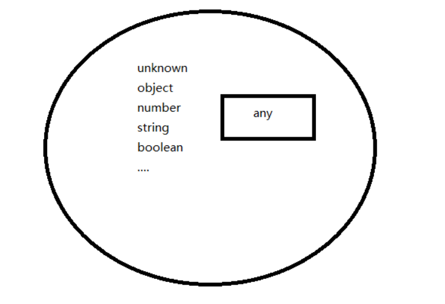
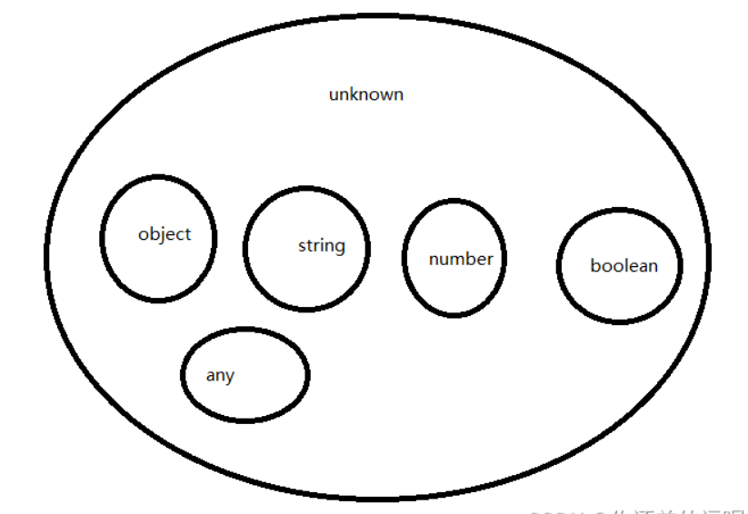
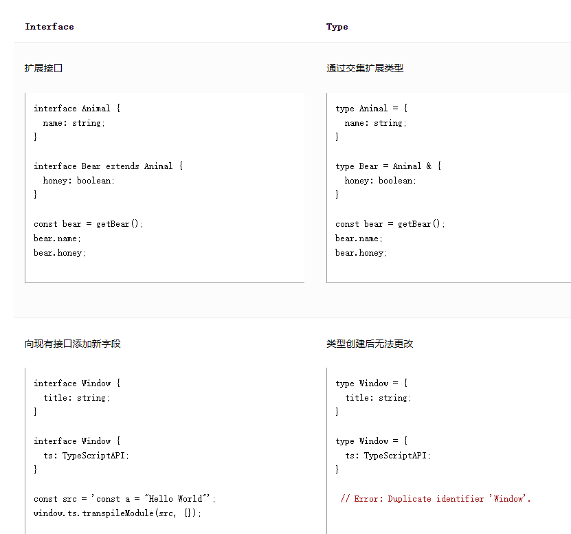
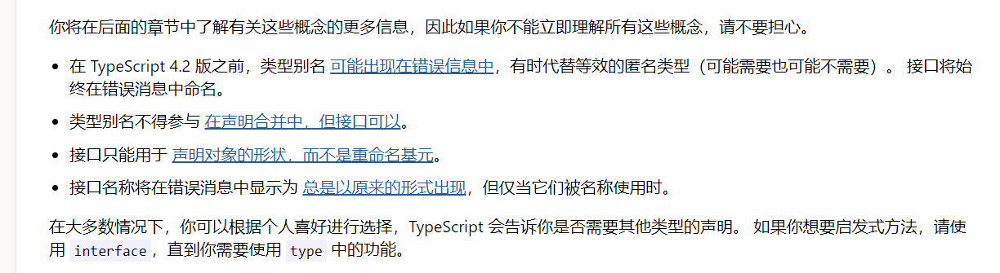

# TypeScript

TypeScript 提供了 JavaScript 的所有功能，以及在这些功能之上的附加层： TypeScript 的类型系统。

## 运行

### 安装

vscode

在文件夹中安装ts

```cmd
npm install -g typescript 
#检查是否安装
tsc -v
#生成配置文件 -->tsconfig.json
tsc --init
```

### 编译

浏览器识别不了ts文件，因此编译过程是将ts->js

- 命令行编译 

  - ```cmd
    tsc test.ts(文件名)
    ```

- vscode自动化编译

  - https://www.jb51.net/javascript/2858665nq.htm
  - 在tsconfig.json中配置编译后的文件夹和严格模式false
  - 终端->运行任务->显示所有任务->找到对应任务的监视 单击 （tsc -w 可运行该文件夹下所有ts文件）

- 控制台直接运行

  - vscode插件 Code Runner

  - ```cmd
    #安装ts包
    npm i typescript ts-node @types/node@* -g
    ```

    

## 类型系统

沿用js的原始类型：boolean，bigint（可以用来表示任意精度整数的基本数据类型），null，string，number，symbol，undefined

### 扩展类型

any，unknown，never，void

#### any

可以表示任意类型， 可以是一个集合， 里面包含了所有的类型，不会对其类型检查，跟js一个意思



#### unknown 

类型安全的any，是所有类型的父级，可以和undfined一起理解

可以把儿子的值赋值给父亲（里氏替换原则）//概念有误！！！！

```java
Object obj = new Person()
```

```ts
let z:number = 1;
let k:unkonwn = z;
//静态类型没有推断出来也可能是unkonwn，
```



但使用的时候要注意先为具体类型或者判断了再使用

```ts
let value: unknown
value = 'abc'

// 声明 让编译器识别为string类型
//为具体类型再使用
(value as string).length
//引入的包、接口等ts不能准确识别，这时候需要预先定义结构或者用as告诉编译器

// 先判断是 string 类型，再使用
if (typeof value === 'string') {
  // value => string
  value.length
}
```

没确定值之前，使用 `unknown` 值做任何事情都是不合法的

```ts
function f1(a: any) {
  a.b(); // OK
}
function f2(a: unknown) {
  a.b();
'a' is of type 'unknown'.
}
```


#### never

永远不会出现/发生的值的类型，不会主动使用，但存在这样的类型

处于TS类型系统的最底层（所有类型的子类）

```ts
let fn = () => {
  throw new Error('err...')
}
let n: never = fn() // n => never
let a: number = 1
a = n
```

正确的执行到最后，没有返回值

声明变量为空数组，never[],

```ts
// 1
let fn = () => {
  // 手动通过 throw 抛出一个异常（错误）
  throw new Error('err...')
}
let n = fn() // n => never

// 2
let fn = () => {
  while (true) {}
}
let n = fn() // n => never

// 3
const num = 123
if (num !== 123) {
  let n = num // n => never
}
```

#### Function

全局类型 `Function` 描述了 `bind`、`call`、`apply` 等属性，以及 JavaScript 中所有函数值上的其他属性。 它还具有 `Function` 类型的值始终可以被调用的特殊属性； 这些调用返回 `any`：

```ts
function doSomething(f: Function) {
  return f(1, 2, 3);
}
```

这是一个无类型的函数调用，通常最好避免，因为不安全的 `any` 返回类型。

如果你需要接受任意函数但不打算调用它，则类型 `() => void` 通常更安全。


### 推断类型

在创建变量并将其分配给特定值时，TypeScript 将使用该值作为其类型。

```ts
let hello = "hello";
//等价
let hello: string;
hello = "hello"
```

复杂类型定义

```ts
const user = {
  name: "Hayes",
  id: 0,
};
```

### 定义类型

```ts
//定义
interface User {
  name: string;
  id: number;
}
//声明
const user: User = {
  name: "Hayes",
  id: 0,
};
//如果声明与定义的类型不匹配则会报错
```

类和面向对象编程

```ts
interface User {
  name: string;
  id: number;
}
 
class UserAccount {
  name: string;
  id: number;
 //构造函数
  constructor(name: string, id: number) {
    this.name = name;
    this.id = id;
  }
}
 
const user: User = new UserAccount("Murphy", 1);
```

函数参数和返回类型

```ts
function deleteUser(user: User) {
  // ...
}
 
function getAdminUser(): User {
  //...
}
```

#### 类型别名和接口

`interface` 的几乎所有功能都在 `type` 中可用，主要区别在于无法重新打开类型以添加新属性，而接口始终可扩展。






### 组合类型

#### 联合

可以声明一个类型可以是多种类型之一

```ts
type MyBool = true | false;
//等价
let MyBool:boolean
```

联合类型的一个流行用例是描述允许值是的 `string` 或 `number` [字面](https://ts.nodejs.cn/docs/handbook/2/everyday-types.html#literal-types) 的集合：

```ts
type WindowStates = "open" | "closed" | "minimized";
type LockStates = "locked" | "unlocked";
type PositiveOddNumbersUnderTen = 1 | 3 | 5 | 7 | 9;
```

例子：会报错 类型'2'不能赋值给类型'myNumber'。

```ts
type myNumber = 1|5|9;
let b:myNumber = 2;
console.log(b);
```

联合也提供了一种处理不同类型的方法。 例如，你可能有一个接受 `array` 或 `string` 的函数：

```ts
function getLength(obj: string | string[]) {
  return obj.length;
}
```

可以用typeof来判断类型

你可以根据传递给函数的是字符串还是数组来使函数返回不同的值：

```ts
function wrapInArray(obj: string | string[]) {
  if (typeof obj === "string") {
    return [obj];
            
(parameter) obj: string
  }
  return obj;
}
```

#### 泛型

泛型为类型提供变量。 一个常见的例子是数组。 没有泛型的数组可以包含任何东西。 具有泛型的数组可以描述数组包含的值。

```ts
type StringArray = Array<string>;
type NumberArray = Array<number>;
type ObjectWithNameArray = Array<{ name: string }>;

```

https://blog.csdn.net/weixin_41277748/article/details/126514221?ops_request_misc=%257B%2522request%255Fid%2522%253A%2522169683463916800226565092%2522%252C%2522scm%2522%253A%252220140713.130102334..%2522%257D&request_id=169683463916800226565092&biz_id=0&utm_medium=distribute.pc_search_result.none-task-blog-2~all~top_positive~default-1-126514221-null-null.142^v95^chatgptT3_1&utm_term=ts%20%E6%B3%9B%E5%9E%8B&spm=1018.2226.3001.4187

##### 基本使用

可以使用 `any` 类型来描述恒等函数

```ts
function identity(arg: any): any {
  return arg;
}
```

使用 `any` 肯定是泛型的，因为它会导致函数接受 `arg` 类型的任何和所有类型.

但实际上我们正在丢失函数返回时该类型的信息。 如果我们传入一个数字，我们拥有的唯一信息是可以返回任何类型。我们期待传入的是number，但拿到的实际上是any

所以，我们需要一种捕获参数类型的方法，以便我们也可以使用它来表示返回的内容。 我们将使用一个类型变量，一种特殊类型的变量，它作用于类型而不是值。

```ts
function identity<Type>(arg: Type): Type {
  return arg;
}
```

这个 `Type` 允许我们捕获用户提供的类型（例如 `number`），以便我们以后可以使用该信息。 在这里，我们再次使用 `Type` 作为返回类型。 通过检查，我们现在可以看到参数和返回类型使用了相同的类型。 这允许我们在函数的一侧和另一侧传输该类型的信息。

版本的 `identity` 函数是泛型的，因为它适用于多种类型。 与使用 `any` 不同，它也与第一个使用数字作为参数和返回类型的 `identity` 函数一样精确（即，它不会丢失任何信息）。

调用方法

```ts
let output = identity<string>("myString");//显示声明
let output = identity("myString");//隐式传入
```

##### 泛型类型


### 结构类型

TypeScript 的核心原则之一是类型检查侧重于值的形状。 这有时称为 “duck typing” 或 “结构类型”。在结构类型系统中，如果两个对象具有相同的形状，则认为它们属于同一类型。

```ts
interface Point {
  x: number;
  y: number;
}
 
function logPoint(p: Point) {
  console.log(`${p.x}, ${p.y}`);
}
 
// logs "12, 26"
const point = { x: 12, y: 26 };//point符合Point类型，会匹配成功
logPoint(point);

//形状匹配只需要匹配对象字段的一个子集。子集有满足的就可以
const point3 = { x: 12, y: 26, z: 89 };
logPoint(point3); // logs "12, 26"
const rect = { x: 33, y: 3, width: 30, height: 80 };
logPoint(rect); // logs "33, 3"
 
const color = { hex: "#187ABF" };
logPoint(color);
```

类和对象

```ts
class VirtualPoint {
  x: number;
  y: number;
 
  constructor(x: number, y: number) {
    this.x = x;
    this.y = y;
  }
}
 
const newVPoint = new VirtualPoint(13, 56);
logPoint(newVPoint); // logs "13, 56"
//如果对象或类具有所有必需的属性，TypeScript 会说它们匹配，而不管实现细节如何。
```


## 函数

### 函数类型表达式

```ts
function greeter(fn: (a: string) => void) {
  fn("Hello, World");
}
function printToConsole(s: string) {
  console.log(s);
}
greeter(printToConsole);

//类型别名或许更好理解，嵌套的总是要脑子过一层
type GreetFunction = (a: string) => void;
function greeter(fn: GreetFunction) {
  // ...
}
```

语法 `(a: string) => void` 表示 “一个函数，有一个参数，名为 `a`，类型为 `string`，没有返回值(void)”。 就像函数声明一样，如果未指定参数类型，则隐式为 `any`。

ps:跟箭头函数很像，但要注意区分。参数名称是必须的！

### 调用签名

函数除了可调用之外还可以具有属性，函数类型表达式语法不允许声明属性。

```ts
type DescribableFunction = {
  description: string;//其他的属性
  (someArg: number): boolean;//可调用的函数，在参数列表和返回类型之间使用 : 而不是 =>。
};
function doSomething(fn: DescribableFunction) {
  console.log(fn.description + " returned " + fn(6));
}
 
function myFunc(someArg: number) {
  return someArg > 3;
}
myFunc.description = "default description";
 
doSomething(myFunc);
```

构造签名，在函数声明那里用new关键字来写即可

### 泛型函数

当我们想要描述两个值之间的对应关系时，会使用泛型。 我们通过在函数签名中声明一个类型参数来做到这一点：

```ts
function firstElement<Type>(arr: Type[]): Type | undefined {
  return arr[0];
}
```

### 约束条件

我们编写了一些通用函数，可以处理任何类型的值。 有时我们想关联两个值，但只能对某个值的子集进行操作。 在这种情况下，我们可以使用约束来限制类型参数可以接受的类型种类。

让我们编写一个返回两个值中较长者的函数。 为此，我们需要一个 `length` 属性，它是一个数字。 我们通过编写 `extends` 子句将类型参数限制为该类型,<Type extends { length: number }>,是一个泛型，但有有了其约束条件：适用于有length属性的类型。

```ts
function longest<Type extends { length: number }>(a: Type, b: Type) {
  if (a.length >= b.length) {
    return a;
  } else {
    return b;
  }
}
 
// longerArray is of type 'number[]'
const longerArray = longest([1, 2], [1, 2, 3]);
// longerString is of type 'alice' | 'bob'
const longerString = longest("alice", "bob");
// Error! Numbers don't have a 'length' property
const notOK = longest(10, 100);
//Argument of type 'number' is not assignable to parameter of type '{ length: number; }'.
```

```ts
function minimumLength<Type extends { length: number }>(
  obj: Type,
  minimum: number
): Type {
  if (obj.length >= minimum) {
    return obj;
  } else {
    return { length: minimum };//需要返回Type类型，不能往上级转换
/*Type '{ length: number; }' is not assignable to type 'Type'.
  '{ length: number; }' is assignable to the constraint of type 'Type', but 'Type' could be instantiated with a different subtype of constraint '{ length: number; }'.*/
  }
}
```

**规则**： 如果可能，使用类型参数身而不是约束它。始终使用尽可能少的类型参数。如果一个类型参数只出现在一个位置，强烈重新考虑是否真的需要它。

### 可选参数

```ts
function f(x?: number) {
  // ...
}
f(); // OK
f(10); // OK
//尽管参数被指定为 number 类型，但 x 参数实际上将具有 number | undefined 类型，因为 JavaScript 中未指定的参数获取值 undefined。
//请注意，当参数是可选的时，调用者始终可以传递 undefined，因为这只是模拟 “missing” 参数。

//可以提供默认值
function f(x = 10) {
  // ...
}
```


在 JavaScript 中，如果你调用一个参数多于参数的函数，多余的参数将被忽略。 TypeScript 的行为方式相同。 具有较少参数（相同类型）的函数总是可以代替具有更多参数的函数。

> **规则**： 为回调编写函数类型时，切勿编写可选参数，除非你打算在不传递该参数的情况下调用该函数


### 函数重载

```ts
function makeDate(timestamp: number): Date;//重载签名1
function makeDate(m: number, d: number, y: number): Date;//2
function makeDate(mOrTimestamp: number, d?: number, y?: number): Date {
    //具有兼容签名的函数实现
  if (d !== undefined && y !== undefined) {
    return new Date(y, mOrTimestamp, d);
  } else {
    return new Date(mOrTimestamp);
  }
}
const d1 = makeDate(12345678);
const d2 = makeDate(5, 5, 5);
const d3 = makeDate(1, 3);//实现签名不能直接使用
```

从外部看不到实现的签名。 在编写重载函数时，你应该始终在函数实现之上有两个或多个签名。

实现签名还必须与重载签名兼容。

这里有两个例子

```ts
function fn(x: boolean): void;
// Argument type isn't right
function fn(x: string): void;
//This overload signature is not compatible with its implementation signature.
function fn(x: boolean) {}//实现签名函数的参数没有兼容到重载签名 x:boolean|string

function fn(x: string): string;
// Return type isn't right
function fn(x: number): boolean;
//This overload signature is not compatible with its implementation signature.
function fn(x: string | number) {
  return "oops";//参数兼容到了但return没有兼容，string与boolean不匹配
}
```

让我们考虑一个返回字符串或数组长度的函数

```ts
function len(s: string): number;
function len(arr: any[]): number;
function len(x: any) {
  return x.length;
}
```

 但是，我们不能使用可能是字符串或数组的值来调用它，因为 TypeScript 只能将函数调用解析为单个重载

```ts
len(""); // OK
len([0]); // OK
len(Math.random() > 0.5 ? "hello" : [0]);//ERROR
```

因为两个重载具有相同的参数计数和相同的返回类型，我们可以改为编写函数的非重载版本

```ts
function len(x: any[] | string) {
  return x.length;
}
```

==尽可能使用联合类型的参数而不是重载== （因为你总能遇到一些奇怪的问题

### 函数声明this x

TypeScript 将通过代码流分析推断函数中的 `this` 应该是什么.

很多情况下，你需要更多的控制 `this` 代表什么对象。 JavaScript 规范规定你不能有一个名为 `this` 的参数，因此 TypeScript 使用该语法空间让你在函数体中声明 `this` 的类型。

```ts
const user = {
  id: 123,
 
  admin: false,
  becomeAdmin: function () {
    this.admin = true;
  },
};
interface DB {
  filterUsers(filter: (this: User) => boolean): User[];
}
 
const db = getDB();
const admins = db.filterUsers(function (this: User) {//不要使用箭头函数，把this绑定给user
  return this.admin;//声明this是user类型
});


```

### 剩余参数

除了使用可选参数或重载来制作可以接受各种固定参数计数的函数之外，我们还可以使用剩余参数定义接受无限数量参数的函数。

```ts
function multiply(n: number, ...m: number[]) {
  return m.map((x) => n * x);
}
// 'a' gets value [10, 20, 30, 40]
const a = multiply(10, 1, 2, 3, 4);
//这些参数上的类型注释隐式为 any[] 而不是 any，并且给出的任何类型注释必须采用 Array<T> 或 T[] 形式，或者元组类型
```

相反，我们可以使用扩展语法从可迭代对象（例如数组）中提供可变数量的参数。 例如，数组的 `push` 方法接受任意数量的参数：

```ts
const arr1 = [1, 2, 3];
const arr2 = [4, 5, 6];
arr1.push(...arr2);
```

### 参数解构

可以使用参数解构来方便地将作为参数提供的对象解压缩到函数体中的一个或多个局部变量中。

```ts
function sum({ a, b, c }) {//没有做类型要求，既是any
  console.log(a + b + c);
}
sum({ a: 10, b: 3, c: 9 });

//对象的类型注释
function sum({ a, b, c }: { a: number; b: number; c: number }) {
  console.log(a + b + c);
}
// Same as prior example
type ABC = { a: number; b: number; c: number };
function sum({ a, b, c }: ABC) {
  console.log(a + b + c);
}
```

### 函数的可分配性x

函数的 `void` 返回类型可能会产生一些不寻常但预期的行为。(所以不会用就不要乱用)

返回类型为 `void` 的上下文键入 **不** 会强制函数返回某些内容。 另一种说法是具有 `void` 返回类型 (`type voidFunc = () => void`) 的上下文函数类型，当实现时，可以返回任何其他值，但会被忽略。

因此，`() => void` 类型的以下实现是有效的

```ts
type voidFunc = () => void;
//我不需要返回值，不在乎你有没有真的返回给我，真的给我了我ye
 
const f1: voidFunc = () => {
  return true;
};
const f2: voidFunc = () => true;
const f3: voidFunc = function () {
  console.log("3")
  return true;
};
f3();//不会报错，可以执行，照常输出“3”
```

并且当其中一个函数的返回值被赋值给另一个变量时，它会保留 `void` 的类型：

```ts
const v1 = f1();
const v2 = f2();
const v3 = f3();
console.log(v3)//可以输出返回值“true” ->会保留之前的类型
console.log(typeof v3)//boolean
```

这种行为的存在使得即使 `Array.prototype.push` 返回一个数字并且 `Array.prototype.forEach` 方法需要一个返回类型为 `void` 的函数，以下代码也是有效的。

```ts
const src = [1, 2, 3];
const dst = [0];
 
src.forEach((el) => dst.push(el));
```

需要注意的特殊情况，当字面函数定义具有 `void` 返回类型时，该函数必须 **不** 返回任何内容。

```ts
function f2(): void {
  // @ts-expect-error
  return true;
}
const f3 = function (): void {
  // @ts-expect-error
  return true;
};
```


## 类型缩小

针对传入参数有多种情况的情况

### 类型保护

在对其进行特定操作时用typeof确定/缩小类型范围

注意：typeof null 都会是object，function可以识别，

instanceof 检查原型链，对大多数用new构造的有效

### 真实性缩小

&& || if ！等表达式

```ts
function getUsersOnlineMessage(numUsersOnline: number) {
  if (numUsersOnline) {//把数字转化成boolean
    return `There are ${numUsersOnline} online now!`;
  }
  return "Nobody's here. :(";
}
```

这样的数据会转化为false，可以验证参数有效性

```ts
function multiplyAll(values: number[] | undefined,factor: number):
number[] | undefined //return type
{
  if (!values) {
    return values;
  } else {
    return values.map((x) => x * factor);
  }
}
```

### 相等性缩小

switch、相等，不等

```ts
function printAll(strs: string | string[] | null) {
  if (strs !== null) {
    if (typeof strs === "object") {
      for (const s of strs) {//  (parameter) strs: string[]
        console.log(s);
      }
    } else if (typeof strs === "string") {
      console.log(strs); //(parameter) strs: string
    }
  }else{
      log(null)
  }
}
```

JavaScript 对 `==` 和 `!=` 的更宽松的相等性检查也正确地缩小了类型。 检查某事 `== null` 是否实际上不仅检查它是否具体是值 `null` - 它还检查它是否可能是 `undefined`。 这同样适用于 `== undefined`： 它检查一个值是 `null` 还是 `undefined`。


### 对象类型


## 类型操作

TypeScript 的类型系统非常强大，因为它允许用其他类型来表达类型。

### 泛型


### keyof

`keyof` 用于获取类型中所有的键，返回一个联合类型：

```ts
interface Test {
    field1: string;
    field2: number;
}
!!object.keys ->
type Fields = keyof Test
// "field1" | "field2"
```

### 索引访问

我们可以使用索引访问类型来查找另一种类型的特定属性

```ts
type Person = { age: number; name: string; alive: boolean };
type Age = Person["age"];//字符索引本质上也可以看作一个类型
     //type Age = number
type I1 = Person["age" | "name"];
     //type I1 = string | number
type I2 = Person[keyof Person];
     //type I2 = string | number | boolean
type AliveOrName = "alive" | "name";
type I3 = Person[AliveOrName];//！！这个注意一下！！
     //type I3 = string | boolean
```

使用 `number` 来获取数组元素的类型。 可以将它与 `typeof` 结合起来，以方便地捕获数组字面量的元素类型

```ts
const MyArray = [  { name: "Alice", age: 15 },  { name: "Bob", age: 23 },  { name: "Eve", age: 38 },];
type Person = typeof MyArray[number];       
/*type Person = {
    name: string;
    age: number;
}*/
type Age = typeof MyArray[number]["age"];    
	//type Age = number
// Or
type Age2 = Person["age"];     
	//type Age2 = number
```

你只能在索引时使用类型，不能使用 `const` 来进行变量引用，比如

```ts
const key = "age";//本质是js的变量
type Age = Person[key];
/*Type 'key' cannot be used as an index type.
'key' refers to a value, but is being used as a type here. Did you mean 'typeof key'?*/
```

可以将类型别名用于类似样式的重构

```ts
type key = "age";
type Age = Person[key];
```

### 条件类型

```ts
interface Animal {
  live(): void;
}
interface Dog extends Animal {
  woof(): void;
}
 
type Example1 = Dog extends Animal ? number : string;
        
type Example1 = number
 
type Example2 = RegExp extends Animal ? number : string;
        
type Example2 = string
```

条件类型的形式看起来有点像 JavaScript 中的条件表达式 (`condition ? trueExpression : falseExpression`)

看一个案例

```ts
interface IdLabel {
  id: number /* some fields */;
}
interface NameLabel {
  name: string /* other fields */;
}
 
function createLabel(id: number): IdLabel;
function createLabel(name: string): NameLabel;
function createLabel(nameOrId: string | number): IdLabel | NameLabel;
function createLabel(nameOrId: string | number): IdLabel | NameLabel {
  throw "unimplemented";
}//包括所有情况的函数重载和实现->显然这样看起来很累赘

type NameOrId<T extends number | string> = T extends number ? IdLabel: NameLabel;
//对函数进行简化
function createLabel<T extends number | string>(idOrName: T): NameOrId<T> {
  throw "unimplemented";
}
let a = createLabel("typescript");
   //let a: NameLabel
let b = createLabel(2.8);
 //let b: IdLabel
let c = createLabel(Math.random() ? "hello" : 42);
	//let c: NameLabel | IdLabel
```

约束

```ts
type MessageOf<T extends { message: unknown }> = T["message"];
interface Email {
  message: string;
}
type EmailMessageContents = MessageOf<Email>;
              //type EmailMessageContents = string
```

分布式条件类型

当条件类型作用于泛型类型时，它们在给定联合类型时变得可分配。 

```ts
type ToArray<Type> = Type extends any ? Type[] : never;
//如果将联合类型插入 `ToArray`，那么条件类型将应用于该联合的每个成员。
type StrArrOrNumArr = ToArray<string | number>;
	//type StrArrOrNumArr = string[] | number[]
```


### 映射类型

枚举

js对象单项映射

ts中的美剧，字符类型单项，数字类型双向映射


## 工具类型


Partial，让所有属性变为可选，类似浅拷贝，智能让最外层的属性可选 1

Required，让all属性变为必选

Readonly，可读

Record，以选中类型生成键值对

Exclude，排除选中类型

Extract，保留选中类型

NonNullable，排除null和undefined

Pick，选中的类型生成新类型

Omit，排除选中的类型，剩下的生成新类型

Paramenters，函数的参数类型

ReturnTypes，函数的返回类型

## 类

### implements/extends

```ts
interface Pingable {
  ping(): void;
}
 
class Sonar implements Pingable {
  ping() {
    console.log("ping!");
  }
}
 
class Ball implements Pingable {
Class 'Ball' incorrectly implements interface 'Pingable'.
  Property 'ping' is missing in type 'Ball' but required in type 'Pingable'.
  pong() {
    console.log("pong!");
  }
}
```

TypeScript 强制派生类始终是其基类的子类型。

在继承后重写函数时要注意

```ts
class Base {
  greet() {
    console.log("Hello, world!");
  }
}
class Derived extends Base {
  greet(name?: string) {
    if (name === undefined) {
      super.greet();
    } else {
      console.log(`Hello, ${name.toUpperCase()}`);
    }
  }
}
 
const d = new Derived();
d.greet();
d.greet("reader");
```

### 跨层级 `protected` 访问 

不同的 OOP 语言对于通过基类引用访问 `protected` 成员是否合法存在分歧：

```ts
class Base {
  protected x: number = 1;
}
class Derived1 extends Base {
  protected x: number = 5;
}
class Derived2 extends Base {
  f1(other: Derived2) {
    other.x = 10;
  }
  f2(other: Derived1) {
    other.x = 10;
//Property 'x' is protected and only accessible within class 'Derived1' and its subclasses.
  }
}
```

Java支持，c#和c++认为非法，ts在这里支持c++。虽然Derived2和Derived1都是Base的子类，但不允许在同级Derived2中访问1才能访问的属性。


泛型类

### 运行时this

TypeScript 不会改变 JavaScript 的运行时行为，默认情况下，函数中 `this` 的值取决于函数的调用方式。 在这个例子中，因为函数是通过 `obj` 引用调用的，所以它的 `this` 的值是 `obj` 而不是类实例。

```ts
class MyClass {
  name = "MyClass";
  getName() {
    return this.name;
  }
}
const c = new MyClass();
const obj = {
  name: "obj",
  getName: c.getName,
};
 
// Prints "obj", not "MyClass"
console.log(obj.getName());
```

用箭头函数可以避免this变成我们不期待的值

```ts
class MyClass {
  name = "MyClass";
  getName = () => {
    return this.name;
  };
}
const c = new MyClass();
const g = c.getName;
// Prints "MyClass" instead of crashing
console.log(g());
```

### 类表达式

类表达式与类声明非常相似。 唯一真正的区别是类表达式不需要名称，尽管我们可以通过它们最终绑定到的任何标识符来引用它们

```ts
const someClass = class<Type> {
  content: Type;
  constructor(value: Type) {
    this.content = value;
  }
};
 
const m = new someClass("Hello, world");
const m: someClass<string>
```

react-> 声明组件 函数式/类组件（实例化

需要反复调用的时候，简单逻辑可以用函数封装，

### abstract


## 模块

### 语法

#### es模块

导出/暴露

```ts
// @filename: hello.ts
export default function helloWorld() {
  console.log("Hello, world!");
}
//可以省略default导出多个
export var pi = 3.14;
export let squareTwo = 1.41;
export const phi = 1.61;

//ts扩展->类型
export type Cat = { breed: string; yearOfBirth: number };
```

导入

```ts
import helloWorld from "./hello.js";
helloWorld();
//引入同一个文件里的多个变量和函数
import { pi, phi, absolute } from "./maths.js";
//可以进行重命名
import { pi as π } from "./maths.js";
//放入单个命名空间：适合全部导入的模块
import * as math from "./maths.js";
//引入但什么都不做：或许会有副作用影响
import "./maths.js";

import type { Cat, Dog } from "./animal.js";
//内联type导入，指示导入的是个类型
import { createCatName, type Cat, type Dog } from "./animal.js";
```

#### CommonJS

导出

```ts
function absolute(num: number) {
  if (num < 0) return num * -1;
  return num;
}
 
module.exports = {
  pi: 3.14,
  squareTwo: 1.41,
  phi: 1.61,
  absolute,
};
```

导入

```ts
const maths = require("./maths");
maths.pi;
```


### 模块解析

模块解析是从 `import` 或 `require` 语句中获取字符串并确定该字符串所指的文件的过程。

TypeScript 包含两种解析策略： 经典和 Node。 Classic 是编译器选项 [`module`](https://ts.nodejs.cn/tsconfig#module) 不是 `commonjs` 时的默认值，包含在内以实现向后兼容性。 Node 策略复制了 Node.js 在 CommonJS 模式下的工作方式，并额外检查了 `.ts` 和 `.d.ts`。

### 模块输出目标

有两个选项会影响触发的 JavaScript 输出：

- [`target`](https://ts.nodejs.cn/tsconfig#target) 确定哪些 JS 功能被降级（转换为在较旧的 JavaScript 运行时中运行），哪些保持不变
- [`module`](https://ts.nodejs.cn/tsconfig#module) 确定模块之间使用什么代码进行交互


